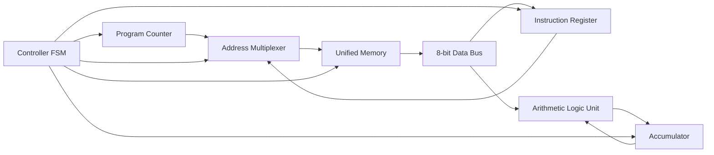
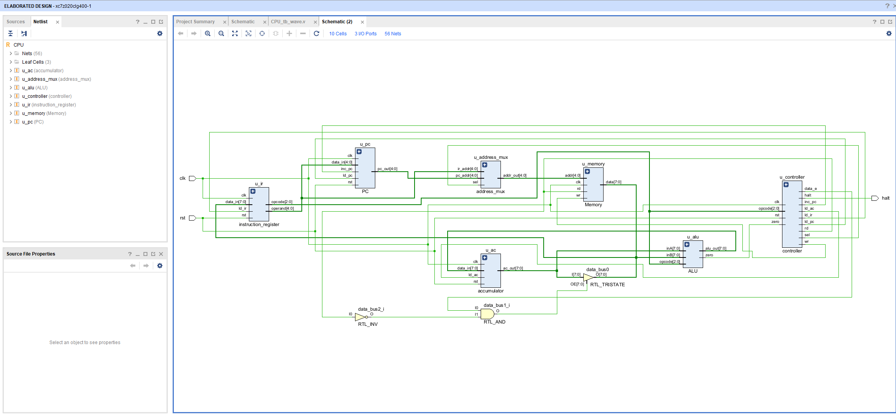
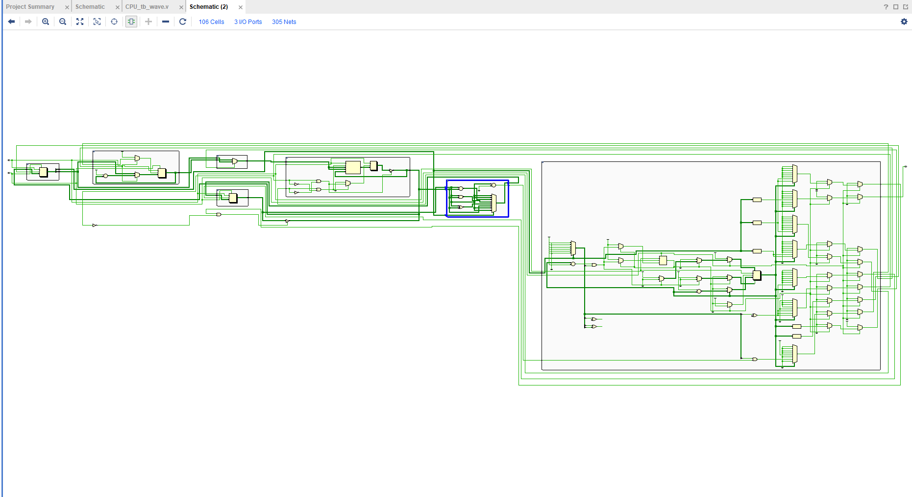
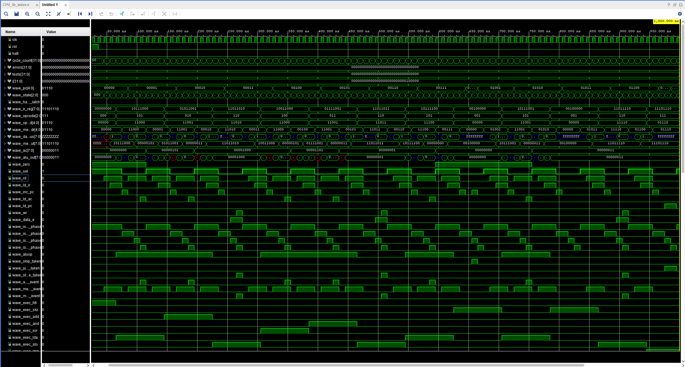
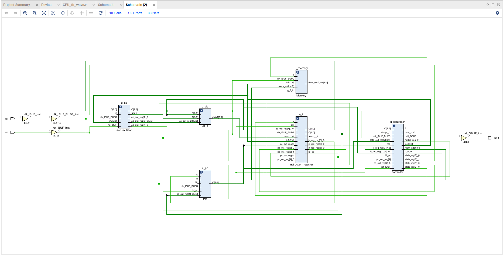

# Verilog Simple RISC Processor

> A modular, multi-cycle, accumulator-based RISC processor implemented in Verilog HDL for computer architecture education and digital system design.


---

## Overview

This repository contains a complete RTL implementation of a simple accumulator-based Reduced Instruction Set Computer (RISC) processor written in synthesizable Verilog HDL.

The project is designed for education and experimentation. It demonstrates:

- processor organization and RTL design;
- separation of datapath and control logic;
- multi-cycle instruction execution;
- finite-state-machine control;
- unified instruction and data memory;
- module-level and CPU integration verification;
- waveform-based debugging and architectural analysis.

The design prioritizes readability, modularity, and ease of extension rather than performance. Each hardware component is implemented as an independent RTL module.

---

## Key Features

- 8-bit accumulator-based datapath
- 8-bit instructions with a 3-bit opcode and 5-bit operand
- 32-address unified program and data memory
- Eight native instructions
- Multi-cycle finite-state-machine controller
- Modular and synthesizable Verilog RTL
- Automated regression and CPU integration tests
- VCD waveform generation for GTKWave
- Vivado RTL elaboration and synthesis support

---

## Processor Specification

| Feature | Description |
|---|---|
| Architecture | Accumulator-based RISC |
| Datapath width | 8 bits |
| Instruction width | 8 bits |
| Opcode width | 3 bits |
| Operand width | 5 bits |
| Address space | 32 memory locations |
| Memory organization | Unified program/data memory |
| Controller | Finite-state machine |
| Execution model | Multi-cycle |
| RTL language | Verilog HDL |
| Primary simulator | Icarus Verilog |

---

## Architecture

The processor consists of a compact datapath and a finite-state-machine controller. Because the architecture is accumulator-based, arithmetic and logical operations use a single general-purpose register: the accumulator (`AC`).



The controller coordinates memory access, register updates, ALU operations, and program-counter changes over multiple clock cycles.

### Vivado Elaborated RTL Schematic

<p align="center">
  
</p>

<p align="center">
  <em>
    Elaborated RTL schematic showing the program counter, instruction register,
    address multiplexer, accumulator, ALU, unified memory, and FSM controller.
  </em>
</p>

<details>
<summary>Detailed synthesized netlist</summary>

<p align="center">
  
</p>

</details>

---

## Instruction Set Architecture

### Instruction Format

Each instruction occupies one byte:

```text
+-------------+----------------+
| Opcode (3)  | Operand (5)    |
+-------------+----------------+
 7         5   4            0
```

- **Opcode** identifies the operation.
- **Operand** represents a memory address or jump destination.

### Instruction Set

| Opcode | Mnemonic | Operation |
|---|---|---|
| `000` | `HLT` | Stop processor execution |
| `001` | `SKZ` | Skip the next instruction when `AC == 0` |
| `010` | `ADD addr` | `AC ← AC + MEM[addr]` |
| `011` | `AND addr` | `AC ← AC AND MEM[addr]` |
| `100` | `XOR addr` | `AC ← AC XOR MEM[addr]` |
| `101` | `LDA addr` | `AC ← MEM[addr]` |
| `110` | `STO addr` | `MEM[addr] ← AC` |
| `111` | `JMP addr` | `PC ← addr` |

---

## Multi-Cycle Execution

Instructions are executed over multiple clock cycles so that datapath resources can be reused. A typical instruction passes through some or all of the following stages:

```text
Instruction Address
        │
        ▼
Instruction Fetch
        │
        ▼
Instruction Load
        │
        ▼
Decode / Idle
        │
        ▼
Operand Address
        │
        ▼
Operand Fetch
        │
        ▼
Execute
        │
        ▼
Write Back
```

The controller selects only the states required by the current instruction.

### Controller States

| State | Purpose |
|---|---|
| `INST_ADDR` | Select the instruction address |
| `INST_FETCH` | Read instruction memory |
| `INST_LOAD` | Load the instruction register |
| `IDLE` | Decode the current instruction |
| `OP_ADDR` | Select the operand address |
| `OP_FETCH` | Read the operand |
| `ALU_OP` | Execute an arithmetic, logical, or control operation |
| `STORE` | Write a result to memory |

### Control Signals

| Signal | Description |
|---|---|
| `rd` | Memory read enable |
| `wr` | Memory write enable |
| `ld_ir` | Load the instruction register |
| `ld_ac` | Load the accumulator |
| `ld_pc` | Load the program counter |
| `inc_pc` | Increment the program counter |
| `sel` | Select the memory address source |
| `data_e` | Enable data-bus output |

---

## RTL Modules

| Module | Responsibility |
|---|---|
| `CPU.v` | Top-level processor and module integration |
| `Controller.v` | FSM sequencing and control-signal generation |
| `ALU.v` | Arithmetic and logical operations |
| `Memory.v` | Unified instruction and data memory |
| `PC.v` | Program counter |
| `IR.v` | Instruction register |
| `AC.v` | Accumulator register |

### `CPU.v`

The top-level module connects the datapath and controller. It selects memory addresses, routes the shared data bus, forwards control signals, and coordinates complete instruction execution.

### `Controller.v`

The controller sequences instruction states and generates the signals required for memory access, register loading, ALU operation, and program-counter updates.

### `ALU.v`

The ALU supports:

- addition;
- bitwise AND;
- bitwise XOR;
- accumulator loading.

It also produces the zero condition used by `SKZ`.

### `Memory.v`

The unified memory stores both instructions and data.

- 32 addressable locations
- 8-bit data width
- asynchronous read
- synchronous write

### `PC.v`

The program counter stores the address of the next instruction and supports:

- increment;
- loading a jump destination;
- synchronous reset.

### `IR.v`

The instruction register holds the current instruction so that its opcode and operand remain stable during execution.

### `AC.v`

The accumulator is the processor's only general-purpose register. It can load an ALU result, retain its current value, or reset synchronously.

---

## Repository Structure

```text
Verilog-Simple-Risc-Processor/
├── src/
│   ├── CPU.v
│   ├── Controller.v
│   ├── ALU.v
│   ├── Memory.v
│   ├── PC.v
│   ├── IR.v
│   └── AC.v
├── testbench/
│   ├── test_001/
│   ├── test_002/
│   ├── ...
│   └── test_010/
├── docs/
│   └── images/
├── run_tests.py
├── LICENSE
└── README.md
```

---

## Verification

The project uses two complementary verification levels:

1. **Module-level verification** checks individual RTL components.
2. **CPU integration verification** checks complete program execution and interactions among processor components.

Tests are compiled with **Icarus Verilog**, executed with `vvp`, and evaluated against expected output.

```text
RTL Source
     │
     ▼
Compile with iverilog
     │
     ▼
Simulate with vvp
     │
     ▼
Compare Output
     │
     ▼
PASS / FAIL
```

### Test Coverage

| Test | Description |
|---|---|
| `test_001` | Program-counter verification |
| `test_002` | Memory-module verification |
| `test_003` | Instruction-register verification |
| `test_004` | Accumulator verification |
| `test_005` | ALU arithmetic and logical operations |
| `test_006` | Controller FSM verification |
| `test_007` | Datapath signal verification |
| `test_008` | CPU instruction execution |
| `test_009` | CPU integration test |
| `test_010` | Waveform-oriented CPU integration |

All eight instructions are exercised by the integration tests:

| Instruction | Verified |
|---|:---:|
| `HLT` | ✓ |
| `SKZ` | ✓ |
| `ADD` | ✓ |
| `AND` | ✓ |
| `XOR` | ✓ |
| `LDA` | ✓ |
| `STO` | ✓ |
| `JMP` | ✓ |

### Behavioral Simulation Waveform

<p align="center">
  
</p>

<p align="center">
  <em>
    Multi-cycle instruction execution showing datapath activity, controller
    sequencing, memory access, conditional skip, jump, and halt behavior.
  </em>
</p>

---

## Running the Project

### Prerequisites

Install:

- Python 3
- Icarus Verilog
- GTKWave for waveform inspection

### Run All Tests

```bash
python3 run_tests.py --src src --testbench testbench --sim icarus
```

### Run a Specific Test

```bash
python3 run_tests.py \
  --src src \
  --testbench testbench \
  --sim icarus \
  --filter test_010
```

Replace `test_010` with the required test name.

### Expected Output

```text
Running test_001 ... PASS
Running test_002 ... PASS
...
Running test_010 ... PASS

Summary

Passed : 10
Failed : 0
Skipped: 0
```

---

## Waveform Debugging

The waveform-oriented integration test produces a Value Change Dump (`.vcd`) file.

Open it with GTKWave:

```bash
gtkwave CPU_tb_wave.vcd
```

Useful signals include:

- program counter;
- instruction register;
- accumulator;
- ALU output;
- memory address and data;
- controller state;
- internal data bus;
- zero flag;
- control signals.

A recommended debugging cycle is:

1. Run the relevant test.
2. Review the simulation output.
3. Inspect the generated waveform.
4. Locate incorrect datapath or controller behavior.
5. Update the RTL.
6. Run the full regression suite.

---

### Vivado Synthesis

### Synthesized Design

<p align="center">
  
</p>

<p align="center">
  <em>
    Synthesized processor schematic generated by Vivado, showing the
    main processor modules and FPGA-specific clock and I/O resources.
  </em>
</p>

### Detailed Synthesized Netlist

<details>
<summary>View detailed synthesized logic</summary>

<p align="center">
  
</p>

<p align="center">
  <em>
    Detailed gate-level view of the synthesized processor logic.
    This diagram illustrates how the RTL design is transformed into
    registers, multiplexers, combinational logic, and control circuitry.
  </em>
</p>

</details>

---

## Design Principles

The implementation intentionally favors clarity over performance:

- one hardware component per source file;
- explicit separation of datapath and control logic;
- a single accumulator instead of a register file;
- multi-cycle execution instead of pipelining;
- a compact instruction set;
- unified program and data memory;
- consistent signal naming;
- synthesizable Verilog constructs.

These choices make the project suitable for introductory computer architecture courses, digital-design laboratories, and architectural experiments.

---

## Current Limitations

The following features are intentionally omitted:

| Feature | Status |
|---|:---:|
| General-purpose register file | ✗ |
| Immediate instructions | ✗ |
| Pipeline | ✗ |
| Hazard detection | ✗ |
| Branch prediction | ✗ |
| Interrupt support | ✗ |
| Cache memory | ✗ |
| Separate instruction and data memory | ✗ |
| Memory-mapped I/O | ✗ |
| Exceptions | ✗ |

---

## Future Work

Possible extensions include:

### Instruction Set

- `SUB` and `OR`
- shift operations
- compare instructions
- immediate operands
- additional conditional branches

### Datapath and Architecture

- register file
- barrel shifter
- status register and additional flags
- Harvard memory organization
- five-stage pipeline
- forwarding and hazard detection
- pipeline flushing
- interrupt controller

### Verification

- functional coverage
- constrained-random testing
- SystemVerilog testbenches
- assertion-based verification
- continuous integration with GitHub Actions

---

## Educational Outcomes

The project provides practical experience with:

- register-transfer-level design;
- modular hardware development;
- datapath organization;
- finite-state-machine control;
- instruction decoding and execution;
- ALU, memory, and program-counter design;
- multi-cycle processor control;
- hardware simulation and verification;
- waveform analysis.

---

## Contributing

Contributions are welcome, including new instructions, additional testbenches, documentation improvements, RTL optimizations, and bug fixes.

1. Fork the repository.
2. Create a feature branch.
3. Commit your changes.
4. Confirm that all regression tests pass.
5. Open a pull request.

---

## Project Status

**Current version:** `1.1`

The project is functionally stable and suitable for educational use. The current release includes the modular RTL implementation, multi-cycle controller, complete original instruction set, automated regression tests, CPU integration tests, waveform debugging, and project documentation.

---

## References

- M. Morris Mano -*Computer System Architecture*
- David A. Patterson and John L. Hennessy -*Computer Organization and Design*
- Stephen Brown and Zvonko Vranesic -*Fundamentals of Digital Logic with Verilog Design*
- IEEE Standard for the Verilog Hardware Description Language

---

## Authors

- **VinhTechiee** -https://github.com/VinhTechiee
- **ladonna-2511** -https://github.com/ladonna-2511
- **lunaz27** -https://github.com/lunaz27

---

## Acknowledgements

This project was developed as part of undergraduate coursework in digital logic and computer architecture.

Special thanks to the instructors and teaching assistants whose lectures and laboratory exercises inspired this educational processor.

---

## License

This project is released under the **MIT License**. See the `LICENSE` file for details.

---

> *"The best way to understand a processor is to build one."*
